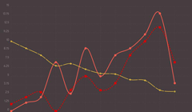
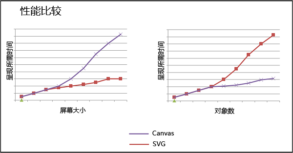


# 浏览器展示图像的的几种方式

在浏览器中,展现图片的方式有 `` `css-background` `<svg>` `<canvas>` 这几种,下面让我们逐一说说 他们的优缺点.

---
#### 1.使用 img 标签

例如:`` , 直接给其 src属性赋值即可.这可能是最古老的实现在网页中插入图像的方式了(应该是在HTML 1.x 版本中就已经有) 但在 [w3school](http://www.w3school.com.cn/tags/tag_img.asp)中对
 ``标签的解释是: __*`` 标签并不会在网页中插入图像，而是从网页上链接图像。`` 标签创建的是被引用图像的占位空间。*__ 
这大概意思就是说 `img`上显示的图片是可以改变的,他只是一个占位符. `img` 作为最方便的向 HTML中插入图像的方式,可以满足我们绝大多数时候的需求,但也有其自身的问题:

1. 图片内容是静态的,加载完毕后如需改变,则势必会再次发出网络请求,如果频繁的改变起 src 属性,则会造成显示区域闪动.
2. 无法进行自由绘制.
3. `img`中无法嵌套使用 任何子HTML元素.

    *注:在支持 HTML5的浏览器中 可以使用Base64当做图像源 ,一定程度上缓解了这些问题 格式如下:``*


---
#### 2.使用 css 为元素添加 background-image

这也是非常常见的方式,一般网页中的固定区域的ico 都是用此种技术实现,借助 强大的 css 你可以控制dom元素 只显示图片源的一部分,并选择一种填充方式,让图片更优雅的
展示在页面上. 因为这属于 css 的范畴,所以这里不作赘述.

---
#### 3.使用 SVG. 

__这里着重说一下 svg__


`svg` 的全称是*Scalable Vector Graphics*意为*可缩放矢量图形* 于 2003 年 1 月 14 日成为 W3C 推荐标准。svg虽然也属于dom元素,但是他和上面的两个标签用法截然不同
第一 它是矢量的,你可以无限的缩放他.而上面2种都是基于像素的. 第二 它允许用户在上面自由的绘制各种多边形. 对于多边形 svg定义了几种特别的标签 来接受用户自定义的
参数:


+ SVG 有一些预定义的形状元素，可被开发者使用和操作：
    - 矩形 `<rect>`
    - 圆形 `<circle>`
    - 椭圆 `<ellipse>`
    - 线 `<line>`
    - 折线 `<polyline>`
    - 多边形 `<polygon>`
    - 路径 `<path>`

下面举一个使用 svg 的小例子:

<iframe width="100%" height="300" src="../../codepen.html?path=lessons/lesson0/0-1_svg.html&title=第一个 Svg Demo" allowfullscreen="allowfullscreen" frameborder="0"></iframe>


svg可以画出矢量的自定义图形，每一个图形都是一个dom节点，这使得它具备了dom元素的优势特性，如事件绑定，文本渲染,支持css,你甚至可以给他加上css3属性 让其执行一个动画， 
这些都是canvas(下文将会讲到)不具备的，`svg` 非常适合于制作弱刷新的应用，所谓弱刷新就是指一旦图片成像完毕，便不需要在修改，比如 绘制各种报表(饼状图，柱状图，扇形图，折线图，热力图) 这些都是弱刷新场景。




 
### 4.使用 canvas 

canvas是本教程的主角,但究其本身也是一个dom元素. 那为什么把他单独来讲呢,原因是它和其他dom元素的差别是非常巨大的.

+ canvas 特性:
     
    - `canvas` 作用仅是开辟一个空白的绘图区域,你并不能简单的通过指定一个属性 就把一张素材原图画在上面.
    - `canvas` 是支持css的,但`canvas` 里的内容并不受css控制,因为他已经脱离dom的概念了.
    - 在`canvas`上面绘图需要 javascript .
    - `canvas` 向用户提供了2种API 一种是 "context2d API" 另一种是 "WebGL API" 这两种API设计上差异巨大,但都可以用来控制canvas绘图.
    - 在同一个`canvas`里 你不能既使用 `context2d API` 又使用 `WebGL API` .
    - `canvas` 是HTML5 标准里的一部分, 很多老浏览器支持 `svg` 但并不一定支持 `canvas`


简单总结来说,就是 `canvas` 只是一张白纸,在这个纸上,你既可以用铅笔画,也可以用钢笔画,但是你只能选一种.

__下面举一个使用 canvas 的小例子 (使用 context2d API):__


<iframe width="100%" height="300" src="../../codepen.html?path=lessons/lesson0/0-1_canvas.html&title=让我们用canvas 完成刚才svg一样的功能" allowfullscreen="allowfullscreen" frameborder="0"></iframe>

可以看到, `canvas` 比 `svg` 稍稍复杂了些复杂，让我们看下一个实验。


---
### 4.5 canvas 与 svg 的比较
#### 性能比较 :


<iframe width="100%" height="300" src="../../codepen.html?path=lessons/lesson0/0-1_svg_performance.html&title=svg性能测试 -- 绘制10000个圆" allowfullscreen="allowfullscreen" frameborder="0"></iframe>

<iframe width="100%" height="300" src="../../codepen.html?path=lessons/lesson0/0-1_canvas_performance.html&title=canvas性能测试 -- 绘制10000个圆" allowfullscreen="allowfullscreen" frameborder="0"></iframe>

<iframe width="100%" height="300" src="../../codepen.html?path=lessons/lesson0/0-1_webgl_performance.html&title=webgl性能测试 -- 绘制10000个圆" allowfullscreen="allowfullscreen" frameborder="0"></iframe>


__结论:__

::: yellow
单次绘图性能 `webgl` 优于 `context2d api` 和 `svg`,  但注意这也不是绝对的, 因为在`canvas`上不管你采用哪种绘图方式 (`webgl` 或是 `context2d`) 图像都是逐像素进行绘制的,也就是说画布尺寸直接关系到
`canvas`的运算量,在越大的画布上 `svg`的优势就越明显, 但如果只比较  `webgl` 和 `context2d`的话, `webgl` 性能会好一些.
:::




图片来自[Kun.H 的博客](http://www.padding-left.com/?p=62)


细心的同学可能已经看到了, 在webgl的例子中,逻辑量比 context2d 要大许多, 那是因为`webgl`的API 非常底层, 画一个小黑点可能都需要写上十几行的代码.


#### 事件比较

__[w3school](http://www.w3school.com.cn/html5/html_5_canvas_vs_svg.asp)上是这样说的__: SVG 基于 XML，这意味着 SVG DOM 中的每个元素都是可用的。您可以为某个元素附加 JavaScript 事件处理器。在 SVG 中，每个被绘制的图形均被视为对象。如果 SVG 对象的属性发生变化，那么浏览器能够自动重现图形。

__svg:__

```javascript
 var mysvg = document.getElementById('svg1') //svg 节点
 mysvg.addEventListener("click", function (e) {
    var target = e.target; //获取被点击的节点
    target.setAttribute("r","50"); //从新设置他的半径值
 });
```

获取节点,绑定事件,这些我们已经轻车熟路了.

__canvas:__

```javascript
//简单计算两点间的距离
function getDistance(x,y,x1,y1) {
    var distance = Math.sqrt((x - x1) * (x - x1) + (y - y1) * (y - y1));
    return distance;
}


var currentX; //点前鼠标点击的坐标
var currentY;
var canvas = document.getElementById('canvas1') //获取canvas 节点
canvas.addEventListener("click", function (e) {
    currentX = e.clientX - marginLeft; //由于 e.clientX 是相对于整个页面的,所以需要转换成相对canvas的
    currentY = e.clientY - marginRight;

    var distance = getDistance(currentX, currentY, 100, 70);
    if (distance<40) { //若果你点击的位置正好位于半径以内,则判定当前圆被点击
        radius1 = 50;
    }

    redraw(); //这里是从新绘图的方法. 略...

});
```

__结论:__

::: yellow
`svg` 下的事件绑定非常简单,而`canvas`则不同.  你只能给最外层的`canvas` 标签绑定事件,再往下(`canvas`里的元素)就需要用户手动进行事件分发. 
:::

基本上


#### 易用性比较

__svg:__

```xml
<svg id="mysvg" xmlns="http://www.w3.org/2000/svg" version="1.1" width="500" height="150">
        <circle cx="100" cy="70" r="40" stroke="black" stroke-width="2" fill="red"></circle>
        <polygon points="220,100 300,210 170,250 123,234" style="fill:#cccccc; stroke:#000000;stroke-width:1"/>
</svg>
```

svg 有很多现成的图形标签, 比如 `circle` `polygon` `polyline` , 使用者只需要将参数填入该标签的属性中即可完成绘制.


__canvas:__
```xml
<canvas id="canvas"></canvas>
```


```javascript
var context = canvas.getContext("2d");
context.clearRect(0,0,500,150);
context.beginPath();
context.arc(100, 70, radius1, 0, Math.PI * 2, true);
//不关闭路径路径会一直保留下去，当然也可以利用这个特点做出意想不到的效果
context.fillStyle = 'rgba(255,0,0,1)';
context.lineWidth = 2;
context.strokeStyle = "black"
context.fill(); //填充图形
context.stroke(); //描边图形
context.closePath(); //闭合路径
```

可以看到,在 `canvas` 上绘制图形,要比 `svg` 稍稍繁琐一些.

__结论成一张图表:__


||canvas WebGL|canvas context2D|svg|笔者注释|
|---|---|---|---|---|
|__分辨率__|依赖|依赖|不依赖,可以自适应|canvas在绘图时必须要指定宽高，而svg 得益于本身是dom可以做到自动适配屏幕。|
|__事件处理__|不支持|不支持|支持| canvas需要手动进行事件分发.|
|__文本渲染__|无|弱文本渲染能力|支持css,完美支持文本|最适合具有大渲染面积的应用（谷歌地图）|上文讲了，svg可以适配各种分辨率，所以比较适合地图|
|__素材源__|只能加载是`长` `宽` 为2的倍数的素材|任意尺寸,甚至是`video`|原生支持|svg 一般只是绘制矢量图不用位图资源|
|__性能__|底层GPU加速 飞快|部分支持硬件加速|一般dom节点|svg 在某些需要大面积渲染区域的时候最适合.|
|__普遍性__|尖端浏览器 IE 11+ chrome FF|支持HTML5的浏览器|IE 9+| webgl 正在逐渐普及中...|