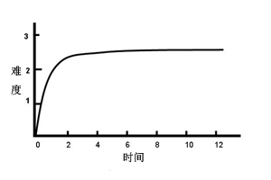

# 如何学习WebGl
首先取决于您目前的基础知识，正如上文我说的，如果您已经有OpenGL的一些编程经验，那么学习WebGL对您来说可能只是小菜一碟，但如果您没有相关的经验，也无妨，因为只要您理解了
`着色器` 原理 并学习一下 `javascript` 基本的用法，也可以很快上手，古人云：知其然 然后知其所以然，意思就是说理解事物的原理永远要比看到并模仿事物的表面现象困难。这里也是如此
我们不妨先来模仿表象，等到学习的知识足够多，足以解释现象的时候我们再来探究原理。


### 学习难度曲线
尽管WebGL有着这样那样的优势， 但一个很残酷的现实是，如果您以前没有任何3D图形学的知识或者绘图经验的话，那么您的学习难度曲线可能是这个样子的：



不过也不要灰心 ^_^ ，本套教程会尽可能使用通俗易懂的语言，帮助您度过入门这道坎。

---


### WebGL 是面向过程的
有c开发经验的朋友，对此肯定不会陌生，笔者也无意争论 面向过程 和面向对象 谁优谁劣，WebGL 其实是 OpenGL 在浏览器端的绑定实现。而绘制图像的程序由于一些历史原因，往往是单线程的。
所以WebGL理所应当 是面向过程的，WebGL和 OpenGL API 又如此接近，所以我们只好适应它，因为这是无法改变的。 但我说的这些都是底层的API，我们可以基于这些API 封装处更高级的，功能更
强大的面向对象接口，或者使用一些大师们已经写好的辅助库 如 `Unity 3D` `Oak3D`  `Philo` `Three.js` `Matrix.js` 等等。这样我们在开发的时候就不必去理会这些恼人的底层接口，代码逻辑也会更清晰，__但笔者还是
坚持建议要从这些最基础的底层知识开始学起__，因为现在的3D辅助库 是在功能太强大了，以至于使用者根本不需要明白矩阵变换原理，光照反射，着色器编程知识 一样可以开发出非常酷炫的3D应用，但
这样一旦遇到 辅助工具解决不了或是官方没有提供现成解决方案的问题时。往往会变得无从入手。不得不从新开始最基础的学习。

__下面举个例子，体会下WebGL的编程思想。__ （也许和您正在使用的编程语言有些不同）

> 这是一个非常简单的面向对象模式下的js程序

```javascript
//js 面向对象Demo

function Person() {
    this.name;
}


Person.prototype.setName = function (name) {
    this.name = "My Name Is " + name;
}

var p=new Person();
var p1 =new Person();

p.setName("p");
p1.setName("p1");

console.log(p.name);
console.log(p1.name);

```

> 但如果是在WebGL下，他很可能是下面这个样子。

```javascript
//webgl 版本

var GLOBAL_P_NAME; //这个讨厌的全局变量 是什么梗？

function createPeople() {
    return {};
}

function setName(people) {
    people.name = "My Name Is " + GLOBAL_P_NAME;
}

var p = createPeople();
P_NAME = "p";
setName(p);
console.log(p.name);


var p1 = createPeople();
P_NAME = "p1";
setName(p1);
console.log(p1.name);

```

上面的例子只为体现这两种思路的不同，当然我想绝大多数人更喜欢第一种方式。但是WebGL却是第二种，所以大家要习惯他的思路，以便于我们更好的学习。


WebGL中 有很多全局变量，而且在很多情况下你是不能直接操作它的，你需要将他绑定到另一个结构或者对象上，然后通过操作这个被绑定的对象来达到操作原对象的目的，
这也许会让人感到很别扭，这个在以后例子中会经常遇到。我们现在只需要了解一下他的编程思路即可。

---

###  介绍几个有助于 WebGL学习的资源网站 这些可能对您非常有用。

|网站|说明|
|---|---|
|[极客学院 WebGL](http://wiki.jikexueyuan.com/project/webgl/)|每一节课程都有很多的Demo非常直观|
|[learningwebgl.com](http://learningwebgl.com/)|可能我知道的是最早也是很全面webgl教程站 可惜是英文的 有能力啃E文的朋友不妨一试|
|[lufy_Legend的个人博客](http://my.csdn.net/lufy_Legend)|开源游戏引擎lufylegend.js 的作者|


###  介绍几本关于学习WebGL的图书

|书名|作者|出版社|说明|
|---|---|---|---|
|《WebGL编程指南》|【美】Kouichi Rodger Lea 著|电子工业出版社|笔者推荐的，偏重基础知识，也讲了一些 矩阵数学运算的基本原理 |
|《WebGL入门指南》|【美】 Tony Parisi，郝嫁力 著|人民邮电出版社|基础知识讲的不多，大量篇幅介绍Three.js|
|《WebGL高级编程》| 【美】Annndreas Anyuru  著|清华大学出版社|偏重基础知识，非常不错的入门书籍|


下一章，让我们正式开始webgl的旅程吧。
