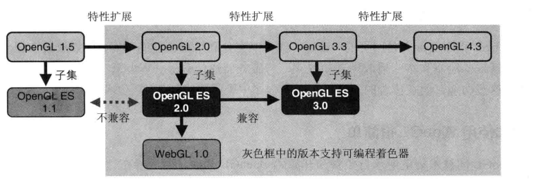

# WebGL入门指南

#### WebGL 是什么
简单来说 WebGL其实是一个接口 (API)，它通过js层（浏览器）与OpenGL层（c,c++ Native层）之间的绑定，可以在浏览器中直接使用js调用OpenGL命令，从而加速图形的绘制速度，以及实现某些复杂3D场景的绘制需求。

#### WebGL ， OpenGL ， OpenGL ES 之间的关系

[WebGL](http://baike.baidu.com/link?url=Apw_VZ3RKIKYxiwbPfWOpF3giJPqeFdcwi-wrLSetsybnxp_Scwk4vrtzvBHAw2bA6HsgkqfQKFlT7B1F9R3Cq) 是基于 [OpenGL ES 2.0](http://baike.baidu.com/link?url=5dMR9rm90HMSW8UoY30e5K4tYL77yBeKvrQUPsDSMauFbosAHU6nRGzcpaUGFBXBWC-Vyp4XuVuCprdmqbzk4K) 演化而来的 （OpenGL ES 是 OpenGL 针对手持移动设备的一个优化版本，也可以说他是 OpenGL的一个子集，它删除了很多针对移动设备不必要的功能，使得其可以消耗更少的资源的同时获得最大程度上的优化。）
如果您已经有OpenGL的编程经验，那您几乎可以无痛的将您的经验传递到Web平台上，因为在后续的学习中你会发现绝大部分 WebGL 的API 风格完全借鉴了OpenGL。 甚至大多数函数名 变量名一个字母都不差。
现在openGL 以及 WebGL的规范定制，都是由大名鼎鼎的 [khronos](http://cn.khronos.org) 小组负责。

> __下图说明了OpenGL OpenGL ES 之间的关系__
>> *图片来自《WebGL编程指南》 【美】Kouichi Rodger Lea 著*
>>> 

#### WebGL 是一项比较新的技术，所以这就意味着并不是所有浏览器都支持:

###### 它目前支持WebGL的浏览器有：

|支持WebGL的浏览器|版本|备注|
|---|---|---|
|Google Chrome |ver 9.0+ |目前支持WebGL最好的浏览器，包括chrome本身 以及所有已`chromium`为内核的 国产浏览器|
|Mozilla Firefox| ver 4.0+|
|Mac Safari|ver 5.1+|
|IE|ver 11+|尽管很不情愿，但 MS还是 IE11 低调支持了 Webgl|

###### 在移动端WebGL的支持情况：

|支持WebGL的浏览器|版本|备注|
|---|---|---|
|Safari IOS |ver 8.0b+ | iPhone iPad|
|Android Broswer| ver 4.4+ | 以及手机,通用其他手持设备 |
|Mozilla Firefox for Android | all | Android MeeGo 以及 FireFox OS |
|Google Chrome for Android|ver 30+|
|IE|ver 11+| windows Phone |

---

#### WebGL特点
正如上文所介绍的那样，WebGL是运行在浏览器平台的API ，所以你不需要安装任何辅助软件，也不需要搭建开发环境，就可以十分方便的使用，你的代码每一次修改不再需要从新编译，
你所要做的只是 Contorl + S + F5 即可，debug 也非常容易，js的灵活性 使你摆脱了c  c++ 指针的困扰，开发效率大幅提升。而且你的程序可以运行在所有 支持WebGL的浏览器上，甚至在手机上。

---

#### 回顾GPU小历史

在这里笔者不想做太多的赘述，但是考虑到有些知识领域的相关性，还是需要稍微的占用一点小篇幅来说明一下， 从1992年，OpenGL 1.0发布 一直到到今天 的WebGL，计算机图形学的发展可谓是
日新月异。早些年，绘图还只是某些专门领域昂贵计算机的工作，他们即笨重又缓慢，当时 SGI 公司首先研发出 GE芯片(Geometry Engine) 其核心是4位向量浮点运算，这使得 矩阵 投影 等运算
到了硬件层面的加速，后来GE功能不断地完善，
一直到上世纪80年代 NVIDIA 公司推出了 GeForce 系列产品，这是一个具有划时代意义的产品，它使 光照 模型变换 等重量级操作 可以在图形运算芯片（GPU）
上直接完成，自此，CPU和GPU 的分工就更加明确。 与此同时 微软也推出了一套 图形变成接口，就是有名的 DirectX 系列（下文简称Dx），他的基本思路和OPENGL 差不多，但Dx针对某些具体的点做了一些有针对
性的操作系统级别的优化， 但在 OpenGL 2.0 以后 Dx 和 OpenGL 走上了相同道路：主要工作重点都放到了 `着色器`的优化上。 __所以说学好 WebGL最关键的就是 理解他的`着色器`__

#### WebGL的舞台
目前