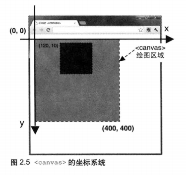

# 从Canvas2d API 说起

 `着色器`是webgl的重点，但是如果上来直接解释 `着色器`的话 可能显得有些唐突，也不好理解，所以就让我们用比较好理解的 canvas2d API入手，来逐步学习`着色器`。

让我们先创建一个简单的程序: 在canvas中画一个正方形

<iframe width="100%" height="250" src="../../../codepen.html?path=lessons/lesson1/chapter1/1-1_canvas.html&title=在canvas中画一个正方形" allowfullscreen="allowfullscreen" frameborder="0"></iframe>

#### 让我们简单解释一下这段代码

__`var context = canvas.getContext("2d");`__  

获取 context2d上下文
|canvas.getContext(`contextType`,`contextAttributes`)|类型||
|---|---|---|
|参数：`contextType`|String|可选值为 `2d` 或 `webgl` 、 `expeimental-webgl`|
|参数：`contextAttributes`|Object 非必填|  例如：{ antialias: false,depth: false,... } 一般只在 contextType 为 webgl 时生效   1.__alpha__:`Boolean` 默认true ,表明了该canvas是否包含alpha通道缓冲  2.__depth__:`Boolean` 默认true, 表明是否包含深度信息  3.__stencil__:`Boolean`  默认false, 表明是否包含至少8位的模板缓冲信息  4.__antialias__:`Boolean`  默认true,是否开启抗锯齿 5.__premultipliedAlpha__:`Boolean`  默认true,表明包含的颜色会预乘alpha 5.__preserveDrawingBuffer__:`Boolean`  默认false,表明缓冲区将不会被清零，除非你手动清除或修改它  6.__failIfMajorPerformanceCaveat__:`Boolean`  默认false,表明当机器性能很差时，是否会依然创建 context对象|
|返回值：|*CanvasRenderingContext2D* 或 *WebGLRenderingContext*|分别对应传入参数`2d` ， `webgl` |

__`context.fillStyle = 'rgba(0,0,0,1)';`__

设置填充颜色为黑色，注意这里一旦设置了填充色，那今后所有执行的填充方法都会将使用这个颜色。

__`context.fillRect(200,50,50,50); `__
|fillRect(x,y,width,height)||
|---|---|
|参数:`x`|矩形左上角的 x 坐标|
|参数:`y`|	矩形左上角的 y 坐标|
|参数:`width`|矩形的宽度，以像素计|
|参数:`height`|矩形的高度，以像素计|

使用上面设置好的 fillStyle 颜色填充一个矩形；

在 canvas2d context 中坐标系如下：

## 第一个 WebGL 程序

用指定颜色填充满画布：

<iframe width="100%" height="250" src="../../../codepen.html?path=lessons/lesson1/chapter1/1-1_webgl.html&title=用蓝色清空画布" allowfullscreen="allowfullscreen" frameborder="0"></iframe>

__`gl.clearColor(0.0, 0.0, 1.0, 1.0);`__
|gl.clearColor(r,g,b,alpha)|类型||
|---|---|---|
|参数:`r`|Number|红色分量 从 0.0-1.0|
|参数:`g`|Number|绿色分量 从 0.0-1.0|
|参数:`b`|Number|蓝色分量 从 0.0-1.0|
|参数:`alpha`|Number|透明度分量 从 0.0-1.0|
|返回值：| 无 ||

他的作用是指定用来清空颜色缓冲区的颜色，一旦执行`clearColor`，则该颜色会驻留在上下中，除非你手动改变他，否则每一次使用 `clear(gl.COLOR_BUFFER_BIT)` 都会使用同样的颜色；
WebGL采用的传统的OpenGL 颜色采样方案，是从 0.0-1.0，而不是 0-255 这样做的原因是方便以后颜色的混合计算。

__`gl.clear(gl.COLOR_BUFFER_BIT);`__
|gl.clear(buffer)|类型|用异或操作符 ‘ ▏’可以同时清空多个缓冲区|
|---|---|---|
|参数:`buffer`|Number|1. gl.COLOR_BUFFER_BIT 指定为颜色缓冲   2. gl.DEPTH_BUFFER_BIT 指定为深度缓冲   3. gl.STENCIL_BUFFER_BIT 指定为模板缓冲
|返回值：| 无 ||

可能大家对缓冲区的概念还比较陌生，这里来解释下，缓冲区其实就是用来保存数据的一个集合，它往往只驻村在内存层面。 在传统的canvas2d API中，设计初衷只是用来绘制2D 图像，没有 Z 轴概念。所以不存在 *深度* 的概念 而WebGL的绘图上下文比 canvas2d API的
要复杂得多，它是专门为3D绘图设计的，在画布的每一个坐标上，除了需要有颜色信息外，还必须有相对应的深度信息。而WebGL中颜色信息是与深度信息分开保存的。所以当你 `clear`的时候必须告诉程序
你想 `clear` 的是哪种信息（颜色还是深度？）所以必须指定 buffer 参数 ，此外我们可以使用异或运算符来一次性清理多个缓冲区 `gl.clear(gl.COLOR_BUFFER_BIT|gl.DEPTH_BUFFER_BIT)`

`clear`被执行后，画布内所有像素的颜色值或深度值 都将被重置为被预先设定的默认值。

    gl.clearColor(0.0, 0.0, 0.0, 1.0); //指定默认颜色

    gl.clearDepth(1.0); //指定默认深度

    gl.stencil(0); //指定默认模板

模板比较复杂，而且用到的场景比较少，这里暂不介绍。

 