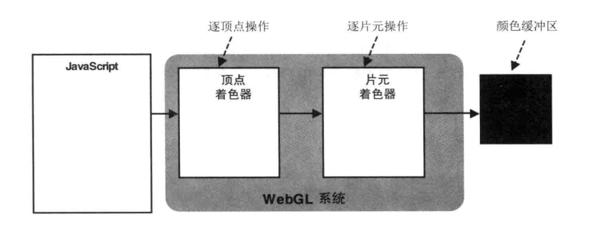
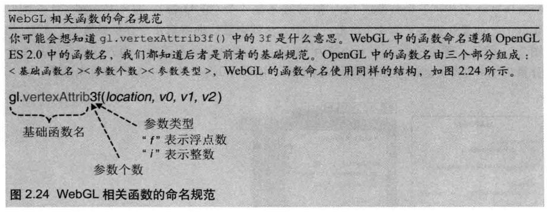
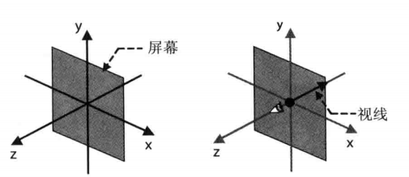
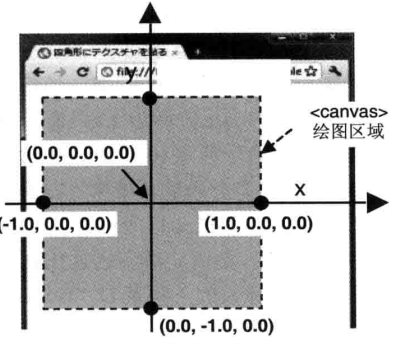

# 最简单的WebGL程序

上一节我们使用颜色来清空整个画布区域，这一节 我们来做一个复杂些的程序。

__使用WebGL在画布上画一个点__

<iframe width="100%" height="250" src="../../../codepen.html?path=lessons/lesson1/chapter2/1-2_dot.html&title=使用WebGL绘制一个红点" allowfullscreen="allowfullscreen" frameborder="0"></iframe>

__着色器在这里第一次登场:__

```xml
<!--顶点着色器-->
<script id="vs" type="x-shader/x-vertex">
        attribute vec4 a_Position;
        void main(void) {
            gl_Position = a_Position;
            gl_PointSize = 50.0;
        }
</script>
<!--片元着色器-->
<script id="fs" type="x-shader/x-fragment">
        precision mediump float;
        void main(void){
            gl_FragColor = vec4(1.0,0.0,0.0,1.0);
        }
</script>

```

着色器本质其实就是 `字符串` ，他往往被嵌入在 js 程序内。

webgl 需要2种着色器，一种是 `顶点着色器` 一种是 `片元着色器`

__顶点着色器(Vertex Shader):__ 它是用来描述三维空间中顶点信息的程序。`顶点` 就是指空间中的一个点。

__片元着色器(Fragment Shader):__ 这是GL领域的一个术语，可能比较晦涩难懂， 简单可以理解为他是控制一个物体上每一个像素颜色的程序。

着色器语言称为 GLSL （OpenGL Shading Language）， GLSL 最后是运行在你的显卡（GPU）上的，其编程风格非常类似 C 语言。

可以看到 在WebGL系统中 当从javascript获得数据后 会先被vertexShader处理，然后再交由fragmentShader处理，最后渲染到缓冲区中。



如上所述，Shader目前还只是`字符串` 如果要使用它，还需要将其编译为对象：

```javascript
var shaderText="\
attribute vec4 a_Position;\
        void main(void) {\
            gl_Position = a_Position;\
            gl_PointSize = 50.0;\
        }";
var vertexShader = gl.createShader(gl.VERTEX_SHADER); //创建 顶点着色器
// var fragmentShader = gl.createShader(gl.FRAGMENT_SHADER); //如果要创建片元着色器，则使用 gl.FRAGMENT_SHADER
gl.shaderSource(shader, shaderText); //设置程序体
gl.compileShader(shader); //编译shader
if (gl.getShaderParameter(shader, gl.COMPILE_STATUS)) { // 判断一下着色器是否编译成功
    // 编译成功，则返回着色器
    return shader;
} else {
    // 编译失败，弹出错误消息
    alert(gl.getShaderInfoLog(shader));
}
```

这样我们就可以分别创建出 Vertex Shader 和 Fragment Shader，但是我们依然无法直接使用这些Shader 刚才我们说了一个完整的 `着色器` 需要由一个顶点着色器 + 一个片元着色器 共同来实现。
那我们们怎么才能把这2个东西合成起来呢？ 便引出了 program 对象一说。

```javascript
// 程序对象的生成

...
var program = gl.createProgram();

// 向程序对象里分配着色器
gl.attachShader(program, vertextShader); //  vertextShader  是刚才生成好的 顶点着色器对象。
gl.attachShader(program, fragmentShader);//  fragmentShader 是刚才生成好的 片元着色器对象。

// 将着色器连接
gl.linkProgram(program);

// 判断着色器的连接是否成功
if (gl.getProgramParameter(program, gl.LINK_STATUS)) {

    // 成功的话，将程序对象设置为有效
    gl.useProgram(program);

    // 返回程序对象
    return program;
} else {

    // 如果失败，弹出错误信息
    alert(gl.getProgramInfoLog(program));
}
...

```

通过 `gl.attachShader` 将两个 shader 归入到同一个program对象中，这样生成的 program对象既是最终可用的。

下面我们来具体讲一下 这两个着色器：

每个着色器都必须有一个 main方法，作为入口方法。且返回类型为 void
```
void main(void) {
    ...
}
```

|类型|变量名|说明|
|---|---|---|
|vec4|gl_Position|`gl_Position`是 vertexShader内置的变量，他表示当前正在绘制的顶点的位置信息 注意是0.0-1.0区间 |
|float|gl_PointSize|`gl_PointSize`是 vertexShader内置的变量，他表示当使用 gl.POINTS 绘制点的时候点的大小 |

`float` 大家都明白，但`vec4` 是什么？

__vec4:__ 他表示由4个float类型的变量组成的矢量。=》\[float,float,float,float\] 但是他并不是简单的 javascript数组，它要求其中的所有元素类型是固定的，且经常用于表示一个点的空间位置（x,y,z,w）或者一个颜色(r,g,b,a)。


::: yellow
__注意：__
GLSL 中是没有类型自动转换的,这就意味着 10≠10.0 同理 10.0 ≠ 10 
:::


顶点着色器控制顶点坐标，而片元着色器控制该坐标上该如何绘制图像。

|类型|变量名|说明|
|---|---|---|
|vec4|gl_FragColor|`gl_FragColor`是 fragmentShader内置的变量，他表示当前绘制顶点的颜色信息。 |


__js如何 与GLSL 数据通信__

`var a_Position = gl.getAttribLocation(prg, 'a_Position');`
|__gl.getAttribLocation(programObj,argName)__| | |
|---|---|---|
|参数:programObj|program对象|指的是已经编译好的`程序对象`(包括一个顶点着色器与一个片段着色器)|
|参数:argName|String|是指要提取的变量位置的变量名，如 a_Position 就是提取在这个程序对象中 a_Position这个变量的内存位置|
|返回: Number|Number| 返回某个变量在指定程序对象中的位置 |

*var a_PositionLocation = gl.getAttribLocation(prg, 'a_Position');* 意思就是获取 prg 中 名为a_Position的变量的位置，并赋值给 a_PositionLocation 这一js变量，
a_Position 将在未来有用处。


`gl.vertexAttrib4f(a_Position, 0.0, 0.0, 0.0, 1.0);`

|__gl.vertexAttrib4f(a_Position, x, y, z, w)__| | |
|---|---|---|
|参数:a_Position|Number指针|`a_Position` 指的是某一个变量在shader中的所在的内存位置。|
|参数:x|float|x 是指将要绘制的顶点的x坐标 |
|参数:y|float|y 是指将要绘制的顶点的y坐标 |
|参数:z|float|z 是指将要绘制的顶点的z坐标 |
|参数:w|float|是齐次坐标的补充坐标 具体参见`齐次坐标` |

*gl.vertexAttrib4f(a_PositionLocation, 0.0, 0.0, 0.0, 1.0);* 意思就是 将 0.0, 0.0 , 0.0, 1.0 这4个float 类型的数据发送给 a_PositionLocation。再看看上文中的 a_PositionLocation定义，
这样js就完成了一次和 GLSL的通信。当然 `gl.vertexAttrib`还有很多兄弟函数，用于将各种各样的数据传送给GLSL。
|方法名|说明|
|---|---|
|gl.vertexAttrib1f(location,v0)|将一个浮点发送给 attribute 变量|
|gl.vertexAttrib2f(location,v0,v1)|将两个浮点发送给 attribute 变量|
|gl.vertexAttrib3f(location,v0,v1,v2)|将三个浮点发送给 attribute 变量|
|gl.vertexAttrib4f(location,v0,v1,v2,v3)|将四个浮点发送给 attribute 变量|
|gl.vertexAttrib1i(location,v0)|将一个整数发送给 attribute 变量|
|... ...|将n个整数发送给 attribute 变量|

这些兄弟函数都是遵循一定规范的，首先都是gl.vertexAttrib前缀开头，然后跟一个变量数，在后跟一个变量类型(f代表float i代表 int)，这些函数还都有另一个数组版本。即第二个参数是一个数组，
比如 `gl.vertexAttrib4f` 他的 数组版本就是  `gl.vertexAttrib4fv` （后加 'v'）用法为：
    
    var floatArr=new Float32Array([0.0,0.0,0.0,1.0])
    gl.vertexAttrib4fv(location,floatArr);

运行后结果和 gl.vertexAttrib4f(location,0.0 , 0.0 , 0.0 , 1.0); 是一样的。




+ __webgl的总体绘图流程是__
    - 首先在js层处理好用来描述图像的数据，在本例中就是要绘制点的位置。
    - 将这些数据通过 WebGL的 API 传送给 GLSL 中。
    - GLSL 中将 js传过来的属于进行处理
    - GLSL 将把图片绘制到缓冲区上。
---

## WebGL中的坐标系

WebGL是专门处理3D图像的，具有 X Y Z 3个坐标轴，并默认是 `右手坐标系`



相对于浏览器窗口而言，Z轴是面向屏幕前方的，最重要的是 其所有轴的原点，是在canvas的中心.




